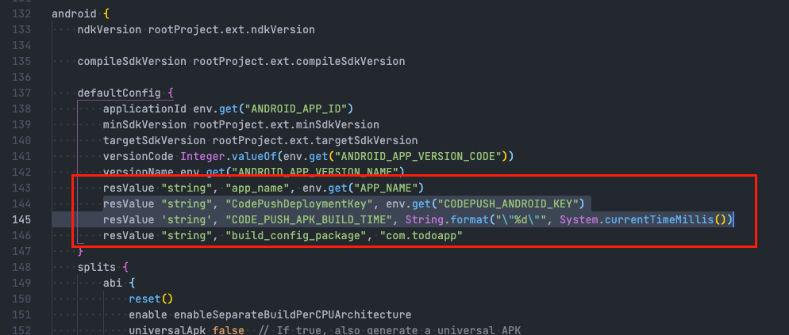

# Code Push Setup

## First step

1. Install `react-native-code-push` package

```bash
$ npm install --save react-native-code-push

$ cd ios && pod install && cd ..
```

2. Update file `App.tsx`

```
...
import CodePush from 'react-native-code-push'
...
...
const CodePushApp = CodePush({
  updateDialog: CodePush.DEFAULT_UPDATE_DIALOG,
  installMode: CodePush.InstallMode.IMMEDIATE,
  checkFrequency: CodePush.CheckFrequency.ON_APP_START,
})(App)

export default __DEV__ ? App : CodePushApp
```


3. Create new project in [Appcenter](https://appcenter.ms/)

4. Update your code push deployment key


5. Update scripts in `package.json`


## For iOS

1. Open up the AppDelegate.m file, and add an import statement:

```
#import <CodePush/CodePush.h>
```


2. Replace `return [[NSBundle mainBundle] URLForResource:@"main" withExtension:@"jsbundle"];` with this line:

```
return [CodePush bundleURL];
```


3. Create new key `CodePushDeploymentKey` with value `RNC_CODEPUSH_IOS_KEY`

## For Android

1. In your android/settings.gradle file, make the following additions at the end of the file:

```
...
include ':app', ':react-native-code-push'
project(':react-native-code-push').projectDir = new File(rootProject.projectDir, '../node_modules/react-native-code-push/android/app')
```

2. Insert this after line `apply from: "../../node_modules/react-native/react.gradle"`

```
apply from: "../../node_modules/react-native-code-push/android/codepush.gradle"
```


3. Add this under `android { defaultConfig {...`

```
resValue "string", "CodePushDeploymentKey", project.env.get("CODEPUSH_ANDROID_KEY")
```



4. Update the MainApplication.java file to use CodePush via the following changes:

```
...
// 1. Import the plugin class.
import com.microsoft.codepush.react.CodePush;

public class MainApplication extends Application implements ReactApplication {

    private final ReactNativeHost mReactNativeHost = new ReactNativeHost(this) {
        ...

        // 2. Override the getJSBundleFile method in order to let
        // the CodePush runtime determine where to get the JS
        // bundle location from on each app start
        @Override
        protected String getJSBundleFile() {
            return CodePush.getJSBundleFile();
        }
    };
}
```
