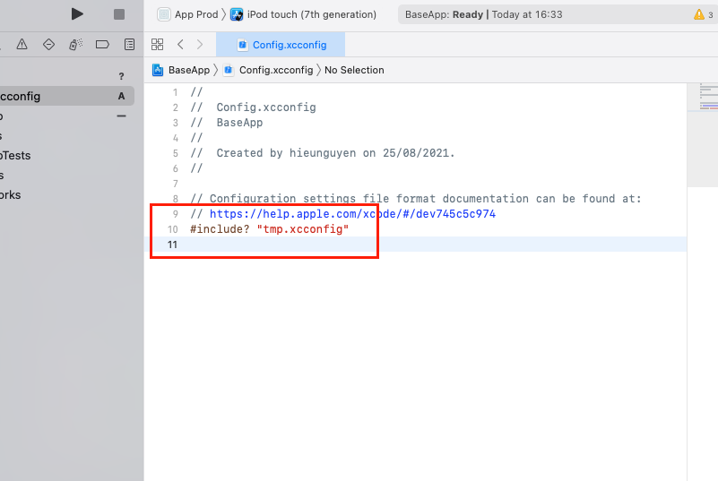

# Environment Setup

## For iOS

1. Open Xcode `$ npm run open-xcode`

2. Config Schema:

- Select Edit Schema...<br />

  

- Create new Schema with name: **App Dev**

  

- Config .env, copy this script: `echo ".env.development" > /tmp/envfile`

  

- Do the same with staging and production environments

  

3. Create file Config:

- Select New File...

  

- Choose `Configuration Settings file`

  

- Copy this script: `#include? "tmp.xcconfig"`

  

- Apply Config:

  

4. Create New Run Script Phase:<br />

- Copy this script: `"${SRCROOT}/../node_modules/react-native-config/ios/ReactNativeConfig/BuildXCConfig.rb" "${SRCROOT}/.." "${SRCROOT}/tmp.xcconfig"`

  

5. Config Builde Setiings:<br />

- Tab All and search with key: `preprocess`
- Set **Preprocess Info.plist File** -> **Yes**
- Set **Info.plist Preprocessor Prefix File** -> `${BUILD_DIR}/GeneratedInfoPlistDotEnv.h`
- Set **Info.Plist Other Preprocessor Flags** -> `-traditional`

  

6. Config Info.plist:

- Set **Bundle display name** -> `RNC_APP_NAME`
- Set **Bundle version string (short)** -> `RNC_IOS_APP_VERSION_CODE`
- Set **Bundle version** -> `RNC_IOS_APP_BUILD_CODE`
  

## For Android

1. Genarate keystore with this script and move the keystore file to ./android/app:

```bash
# Replace DEMO with the name you want
$ keytool -genkeypair -v -keystore DEMO.keystore -alias DEMO-alias -keyalg RSA -keysize 2048 -validity 10000
```

2. Copy this to file ./android/gradle.properties:

```
# infomation develop keystore
DEBUG_STORE_FILE=debug.keystore
DEBUG_KEY_ALIAS=androiddebugkey
DEBUG_STORE_PASSWORD=android
DEBUG_KEY_PASSWORD=android
# infomation staging keystore
STAGING_STORE_FILE=staging.keystore
STAGING_KEY_ALIAS=staging-alias
STAGING_STORE_PASSWORD=app@123
STAGING_KEY_PASSWORD=app@123
# infomation product keystore
PRODUCT_STORE_FILE=product.keystore
PRODUCT_KEY_ALIAS=staging-alias
PRODUCT_STORE_PASSWORD=app@123
PRODUCT_KEY_PASSWORD=app@123
```

> Replace value match with your keystore

3. Open ./android/app/build.gradle:

- Copy this to the top of the file:

```
project.ext.envConfigFiles = [
    develop: ".env.development",
    staging: ".env.staging",
    product: ".env.production",
    anothercustombuild: ".env",
]
```


- Insert this after line `apply from: "../../node_modules/react-native/react.gradle"`

```
apply from: project(':react-native-config').projectDir.getPath() + "/dotenv.gradle"
```


- Update `defaultConfig` like this:

```
    defaultConfig {
        applicationId env.get("ANDROID_APP_ID")
        minSdkVersion rootProject.ext.minSdkVersion
        targetSdkVersion rootProject.ext.targetSdkVersion
        versionCode Integer.valueOf(env.get("ANDROID_APP_VERSION_CODE"))
        versionName env.get("ANDROID_APP_VERSION_NAME")
        resValue "string", "app_name", project.env.get("APP_NAME")
        resValue "string", "build_config_package", {package-name}
    }
```

> Replace {package-name} with your app package name
>
> Find {package-name} in ./android/app/src/main/AndroidManifest.xml


- Update `signingConfigs` like this:

```
    signingConfigs {
        debug {
            storeFile file(DEBUG_STORE_FILE)
            storePassword DEBUG_STORE_PASSWORD
            keyAlias DEBUG_KEY_ALIAS
            keyPassword DEBUG_KEY_PASSWORD
        }
        develop {
            storeFile file(DEBUG_STORE_FILE)
            storePassword DEBUG_STORE_PASSWORD
            keyAlias DEBUG_KEY_ALIAS
            keyPassword DEBUG_KEY_PASSWORD
        }
        staging {
            storeFile file(STAGING_STORE_FILE)
            storePassword STAGING_STORE_PASSWORD
            keyAlias STAGING_KEY_ALIAS
            keyPassword STAGING_KEY_PASSWORD
        }
        product {
            storeFile file(PRODUCT_STORE_FILE)
            storePassword PRODUCT_STORE_PASSWORD
            keyAlias PRODUCT_KEY_ALIAS
            keyPassword PRODUCT_KEY_PASSWORD
        }
    }
```

- Insert this after `buildTypes`:

```
    flavorDimensions "enviroment"
    productFlavors {
        develop {
            dimension "enviroment"
            signingConfig signingConfigs.develop
        }
        staging {
            dimension "enviroment"
            signingConfig signingConfigs.staging
        }
        product {
            dimension "enviroment"
            signingConfig signingConfigs.product
        }
    }
```


4. Go to ./android/app/src/main/res/values/strings.xml and remove all `<string />`


